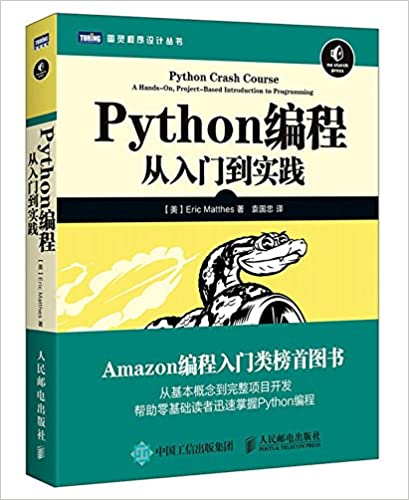
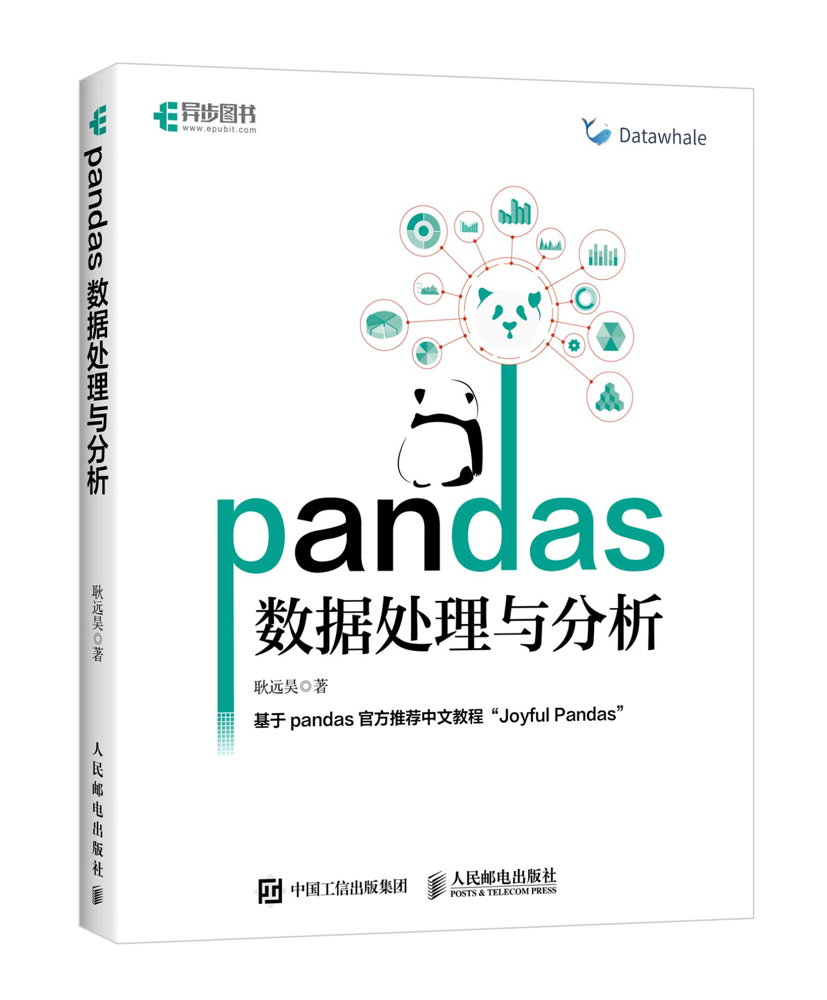
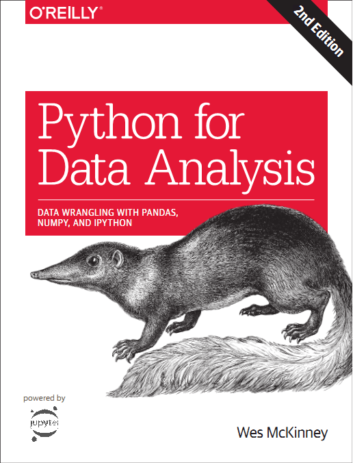

# 下载

## 书籍

>   为中华之崛起而读书！——周恩来

### Python

|                           书籍名称                           |                             封面                             |
| :----------------------------------------------------------: | :----------------------------------------------------------: |
| [Python编程：从入门到实践（第二版）](https://mailsqusteducn-my.sharepoint.com/:b:/g/personal/2129740121_mails_qust_edu_cn/EeGB007peNVPvWaMZSe_BqIBIPfNNZ1amL0L-BqIGbQ7AA?e=tWXdDm) |  |

### 数据分析

|                           书籍名称                           |                             封面                             |
| :----------------------------------------------------------: | :----------------------------------------------------------: |
|          [Numpy中文文档](https://www.numpy.org.cn/)          |  |
|          [Pandas中文文档](https://www.pypandas.cn/)          |  |
|     [Matplotlib中文文档](https://www.matplotlib.org.cn/)     |  |
| [Pandas数据处理与分析](#)（[网页版](http://joyfulpandas.datawhale.club/Content/index.html)） |  |
| [利用 Python 进行数据分析（第 2 版）](https://pyda.apachecn.org/#/) |   |

### 机器学习

|                           书籍名称                           |                             封面                             |
| :----------------------------------------------------------: | :----------------------------------------------------------: |
|                   [机器学习（西瓜书）](#)                    |   |
| [南瓜书](https://github.com/datawhalechina/pumpkin-book/releases/download/v1.9.9/pumpkin_book.pdf)（[网页版](https://datawhalechina.github.io/pumpkin-book/#/)） |  |

### 深度学习

|                           书籍名称                           |                     封面                     |
| :----------------------------------------------------------: | :------------------------------------------: |
| [Deep Learning](https://www.deeplearningbook.org/front_matter.pdf) |  |
| [深度学习](https://github.com/exacity/deeplearningbook-chinese/releases/download/v0.5-beta/dlbook_cn_v0.5-beta.pdf) |   |
|     [Dive into Deep Learning](https://d2l.ai/d2l-en.pdf)     |    |
| [动手学深度学习](https://zh-v2.d2l.ai/d2l-zh-pytorch.pdf)（[网页版](https://zh.d2l.ai/index.html)） |   |

## 工具

> 君子生非异也，善假于物也  ——荀子

- Miniconda
    - [Miniconda3 for Windows x64 Python 3.8](https://repo.anaconda.com/miniconda/Miniconda3-py38_23.3.1-0-Windows-x86_64.exe)
    - [Miniconda3 for Linux x64 Python 3.8](https://repo.anaconda.com/miniconda/Miniconda3-py38_23.3.1-0-Linux-x86_64.sh)
    - [Miniconda3 for Macos Intel bash](https://repo.anaconda.com/miniconda/Miniconda3-py38_23.3.1-0-MacOSX-x86_64.sh)
    - [Miniconda3 for Macos M1 bash](https://repo.anaconda.com/miniconda/Miniconda3-py38_23.3.1-0-MacOSX-arm64.sh)
- Vscode
    - [Vscode Latest for Windows](https://code.visualstudio.com/sha/download?build=stable&os=win32-x64-user)
    - [Vscode Latest deb for Lunux](https://code.visualstudio.com/sha/download?build=stable&os=linux-deb-x64)
    - [Vscode Latest rpm for Linux](https://code.visualstudio.com/sha/download?build=stable&os=linux-rpm-x64)
    - [Vscode Latest for Macos](https://code.visualstudio.com/sha/download?build=stable&os=darwin-universal)
- Pycharm
    - [PyCharm Professional Latest for windows](https://www.jetbrains.com/zh-cn/pycharm/download/download-thanks.html?platform=windows)
    - [PyCharm Community Latest for windows](https://www.jetbrains.com/zh-cn/pycharm/download/download-thanks.html?platform=windows&code=PCC)
    - [PyCharm Professional Latest for Linux](https://www.jetbrains.com/zh-cn/pycharm/download/download-thanks.html?platform=linux)
    - [PyCharm Community Latest for Linux](https://www.jetbrains.com/zh-cn/pycharm/download/download-thanks.html?platform=linux&code=PCC)
    - [PyCharm Professional Latest for Macos Intel](https://www.jetbrains.com/pycharm/download/download-thanks.html?platform=mac)
    - [PyCharm Community Latest for Macos intel](https://www.jetbrains.com/zh-cn/pycharm/download/download-thanks.html?platform=mac&code=PCC)
    - [PyCharm Professional Latest for Macos M1](https://www.jetbrains.com/pycharm/download/download-thanks.html?platform=macM1)
    - [PyCharm Community Lates for Macos M1](https://www.jetbrains.com/zh-cn/pycharm/download/download-thanks.html?platform=macM1&code=PCC)

`Theme` : [Vue](https://theme.typora.io/theme/Vue/)

`Last edited` : 2023/7/10
